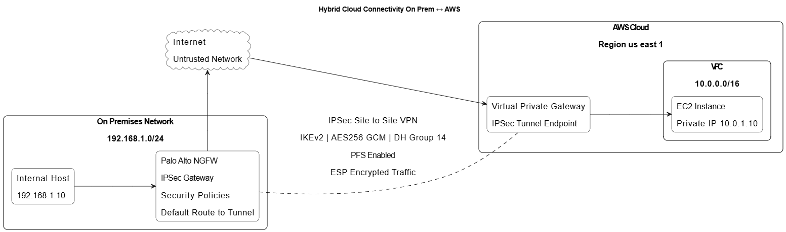

# ipsec-site-to-site-vpn-paloalto-aws
NIST SP 800-77 aligned IPSec Site-to-Site VPN deployment between Palo Alto NGFW and AWS Virtual Private Gateway.
# IPSec Site-to-Site VPN Architecture  
Palo Alto NGFW ↔ AWS Virtual Private Gateway  

## Project Objective  

Design and deploy a secure hybrid-cloud IPSec Site-to-Site VPN between an on-prem Palo Alto Next-Generation Firewall and AWS infrastructure.

This project follows NIST SP 800-77 guidance for IPsec VPN implementations and aligns with the NIST Cybersecurity Framework (Identify, Protect, Detect).

---

## Architecture Overview  

- On-prem Network: 192.168.x.0/24  
- AWS VPC: 10.0.0.0/16  
- VPN Type: IPSec Site-to-Site  
- IKE Version: IKEv2  
- Routing: Static  
- Tunnel Interface: Logical interface bound to virtual router  
- AWS Component: Virtual Private Gateway  

## Architecture Diagram  

---

## Security Configuration  

### IKE Phase 1  

- Encryption: AES-256-CBC  
- Authentication: SHA-256  
- Diffie-Hellman Group: 14  
- Lifetime: 28800 seconds  

### IPSec Phase 2  

- Encryption: AES-256-GCM  
- Perfect Forward Secrecy: Enabled  
- Lifetime: 3600 seconds  

---

## Key Security Decisions  

- Selected AES-256-GCM for strong encryption and integrity protection  
- Enabled Perfect Forward Secrecy to prevent session key compromise  
- Restricted bidirectional traffic using Palo Alto security policies  
- Limited AWS Security Group access to necessary traffic only  
- Ensured proper static route propagation to avoid traffic leakage  

---

## Validation & Testing  

### Tunnel Status Verification  

- Verified IKE and IPSec Security Associations on PAN-OS CLI  
- Confirmed tunnel state as UP in AWS Console  

### Connectivity Testing  

- ICMP testing from on-prem to AWS EC2 private IP  
- ICMP testing from AWS EC2 to internal host  
- Verified encrypted traffic via ESP protocol  

---

## Risk Considerations  

- Prevented downgrade attacks through strong crypto configuration  
- Ensured secure peer authentication using pre-shared keys  
- Monitored Dead Peer Detection to maintain tunnel integrity  
- Validated no unintended open inbound paths  

---

## NIST Alignment  

This implementation aligns with:

- NIST SP 800-77 (IPsec VPN guidance)  
- NIST CSF Identify, Protect, Detect functions  

---

## Key Learning Outcomes  

- Hybrid cloud security architecture design  
- Secure VPN deployment in AWS environment  
- Firewall crypto profile configuration  
- Tunnel troubleshooting and validation  
- Applying federal security framework guidance to real-world implementation  

---

## Disclaimer  

All IP addresses, identifiers, and configuration details have been sanitized for security purposes.  
This project was conducted in a controlled lab environment.
